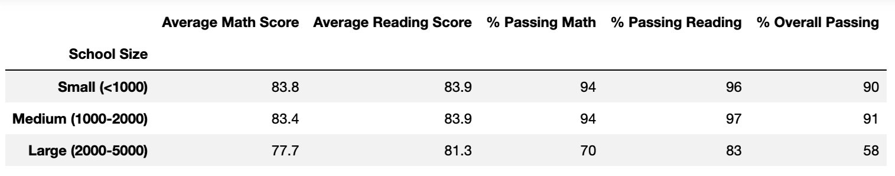

# School District Analysis with Pandas 

## Overview of Project

* Maria, the chief data scientist for a city school district, needs to analyze data on student funding and standardized test scores
* Maria needs help analyzing the data to provide insight about performance trends and patterns
* These insights will inform discussions and strategic decisions at the school and district level 

### Additional Overview 

* Thomas HS 9th grade test scores have been altered, which means they should be removed from the initial analysis 
* New results should be presented

### Purpose

* To aggregate the data to showcase trends in school performance
* Provide data analysis that will aid Maria and the school board to make decisions on school budgets and priorities 
* Update data analysis by removing Thomas HS 9th grade test scores from the data and presenting the new results

## Results: Before and After the Removal of Thomas HS 9th Grade Test Scores 

### District Summary

#### Changes 

1. Average Math Score: 79.0 to 78.9 (-0.1)
2. % Passing Math: 75.0% to 74.8% (-0.2%)
3. % Passing Reading: 85.8% to 85.7% (-0.1%)
4. % Overall Passing: 65.2% to 64.9% (-0.3%)

#### Data

* Before: 
* After: 

### School Summary: Thomas HS Only School with Changes

#### Changes for Thomas HS 

1. Average Math Score: 83.42 to 83.35 (-0.07)
2. Average Reading Score: 83.85 to 83.90 (+0.05)
3. % Passing Math: 93.27% to 93.19% (-0.08%)
4. % Passing Reading: 97.31% to 97.02% (-0.29%)
5. % Overall Passing: 90.95% to 90.63% (-0.32%)

#### Data 

* Before: 
* After: 

### Thomas HS Relative to Other Schools 

#### Changes

* Thomas HS's status remains the same relative to other schools, with the second highest overall passing percentage. 
* However, as mentioned in the School Summary section, Thomas HS's overall passing percentage decreases by 0.32%. 

#### Data

* Before: 
* After: 

### Math and Reading Scores by Grade

#### Changes

* Math Changes: Thomas HS 9th grade's omission is the only change for math scores by grade
* Reading Changes: Thomas HS 9th grade's omission is the only change for reading scores by grade 

#### Data

* Math Before:

* Math After:

* Reading Before:

* Reading After:

### Scores by School Spending

#### Changes

* There are no changes in scores by school spending.

#### Data

* Before: 
* After: 

### Scores by School Size

#### Changes

* There are no changes in scores by school size.

#### Data

* Before: 
* After: 

### Scores by School Type 

#### Changes

* There are no changes in scores by school type.

#### Data

* Before: 
* After: 

## Summary: Four Changes in the School District Analysis 

1. For the district summary, there are slight decreases in Average Math Score, % Passing Math, % Passing Reading, and % Overall Passing.
2. Thomas HS's Average Math Score decreases, while its Average Reading Score increases.
3. Thomas HS sees a 0.32% decrease in % Overall Passing. 
4. Relative to other schools, Thomas HS remains second in overall passing percentage. However, after the change, Thomas HS leads Griffin High School by a small margin (0.03%). 

## Conclusion

1. Removing Thomas HS 9th grade test scores altered the results but not significantly. There are slight changes to the district summary. In addition, the results from Thomas HS differ from the initial analysis, such as the 0.32% decrease in % Overall Passing. 
2. Overall, the removal did not impact the data significantly. No changes in the data for the sections Scores by School Spending, Scores by School Size, and Scores by School Type, demonstrate the validity of this claim. 